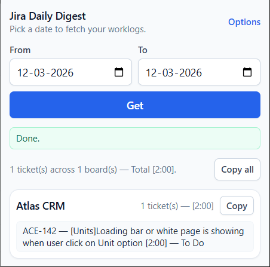
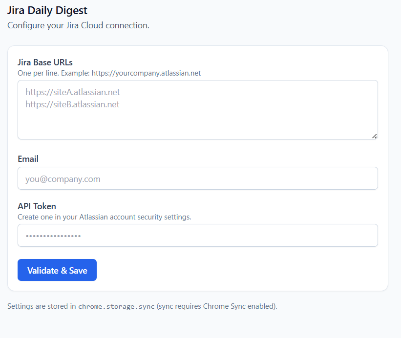
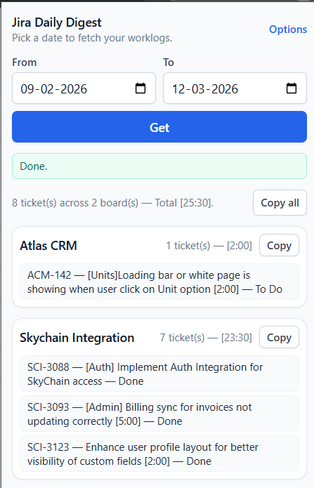

# Jira Daily Update (Chrome Extension)

Generate daily or date-range Jira worklog updates from your Jira Cloud account. Pick From/To dates, see tickets grouped by project with totals, and copy one combined update or per-project (board-wise).

---

## Screenshots

**Popup – single day**  
*One board, one ticket.*



**Options – configure Jira**  
*Add multiple Jira Base URLs, email, API token; Validate & Save.*



**Popup – date range**  
*Multiple boards (e.g. Atlas CRM, Skychain Integration) with totals and per-board Copy.*



---

## What it does

- **Date range**: From / To (defaults to today).
- **Multi-site**: Fetch from one or more Jira Cloud base URLs.
- **Display**: Ticket key, summary, time logged, status — grouped by project (board).
- **Totals**: Overall time and per-project time.
- **Copy**: “Copy all” for one block, or “Copy” on a project card for that board only.
- **Copy format** (no site/domain in text):

```
-------------------------------------------------
Today's Update - [DD-MM-YYYY]     (when From = To = today)
-------------------------------------------------
Total - [h:mm]
-------------------------------------------------
Project Name [h:mm]
-------------------------------------------------
- KEY - Summary [h:mm] - Status
```

Only projects with logged time in the range are shown.

---

## Setup

1. **Install and build**

```bash
npm install
npm run build
```

2. **Load in Chrome**

- Open `chrome://extensions`
- Turn on **Developer mode**
- **Load unpacked** → select this folder (e.g. `jira-ext`)

3. **Configure**

- Open **Options** (link in popup)
- **Jira Base URLs**: one per line (e.g. `https://yourcompany.atlassian.net`)
- **Email**: your Atlassian email
- **API Token**: from [Atlassian API tokens](https://id.atlassian.com/manage-profile/security/api-tokens)
- Click **Validate & Save** — invalid URLs are removed; only valid ones are saved

Settings are stored in `chrome.storage.sync` (synced if Chrome Sync is on).

---

## Using the popup

- Set **From** and **To** dates → click **Get**
- Use **Copy all** for the full update, or **Copy** on a project card for that board only

---

## Icons

Put extension icons in `icons/`:

- `icon16.png`, `icon32.png`, `icon48.png`, `icon128.png`

See `icons/README.txt` for details.
